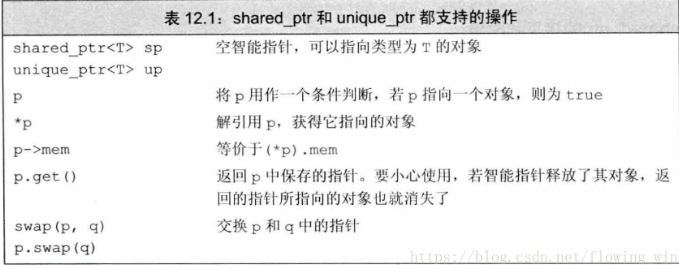
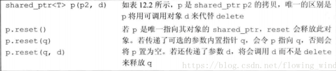
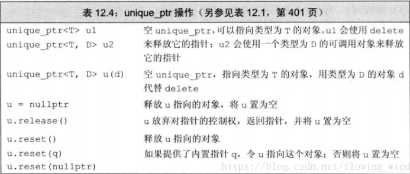

# smart pointer 
每个程序有三个内存：静态内存+栈内存+堆内存（内存池）  
new:在动态内存中为对象分配一块空间并返回一个指向该对象的指针。  
delete：指向一个动态独享的指针，销毁对象，并释放与之关联的内存。  

## 经常出现的问题
一种是忘记释放内存，会造成内存泄漏；  
一种是尚有指针引用内存的情况下就释放了它，就会产生引用非法内存的指针。  

## 引入智能指针
行为：类似常规指针，重要的区别是它负责自动释放所指向的对象。  
shared_ptr允许多个指针指向同一个对象；  
unique_ptr则“独占”所指向的对象。  
标准库还定义了一种名为weak_ptr的伴随类，它是一种弱引用，指向shared_ptr所管理的对象；  
```c++
#include <memory>
```

## shared_ptr
创建智能指针时必须提供额外的信息，指针可以指向的类型：  
```c++
shared_ptr<string> p1;
shared_ptr<list<int>> p2;
```
默认初始化的智能指针中保存着一个空指针；  
使用：解引用一个智能指针返回它指向的对象，在一个条件判断中使用智能指针就是检测它是不是空;   
```c++
if(p1 && p1->empty())
	*p1 = "hi";
```
下图表示shared_ptr和unique_ptr都支持的操作：  
  
下图表示shared_ptr所特有的操作：  


### make_shared
最安全的分配和使用动态内存的方法：调用make_shared的标准库函数，此函数在动态内存中分配一
个对象并初始化它，返回指向此对象的shared_ptr。头文件和share_ptr相同，在memory中。  
必须指定想要创建的对象的类型，格式如下：  
```c++
shared_ptr<int> p3 = make_shared<int> 42;
shared_ptr<string> p4 = make_shared<string>(10, '9');
shared_ptr<int> p5 = make_shared<int>();
```
### shared_ptr的拷贝和赋值
当进行拷贝和赋值时，每个shared_ptr都会记录有多少个其他shared_ptr指向相同的对象。  
```c++
auto p = make_shared<int>(42);
auto q(p);
```

### shared_ptr引用计数原理
我们可以认为每个shared_ptr都有一个关联的计数器，通常称其为引用计数，无论何时我们拷贝一个
shared_ptr，计数器都会递增。当我们给shared_ptr赋予一个新值或是shared_ptr被销毁（
例如一个局部的shared_ptr离开其作用域）时，计数器就会递减，一旦一个shared_ptr的计数器变为0,
它就会自动释放自己所管理的对象。
```c++
auto r = make_shared<int>(42);//r指向的int只有一个引用者
r=q;//给r赋值，令它指向另一个地址
	//递增q指向的对象的引用计数
	//递减r原来指向的对象的引用计数
	//r原来指向的对象已没有引用者，会自动释放
```
### shared_ptr自动销毁所管理的对象
当指向一个对象的最后一个shared_ptr被销毁时，shared_ptr类会自动销毁此对象，它是通过另一个特殊
的成员函数-析构函数完成销毁工作的，shared_ptr的析构函数会递减它所指向的对象的引用计数。
如果引用计数变为0，shared_ptr的析构函数就会销毁对象，并释放它所占用的内存。

### shared_ptr还会自动释放相关联的内存
当动态对象不再被使用时，shared_ptr类还会自动释放动态对象，这一特性使得动态内存的使用变得非常容易。
如果你将shared_ptr存放于一个容器中，而后不再需要全部元素，而只使用其中一部分，要记得用erase删除不
再需要的那些元素。

### 内存耗尽
虽然现代计算机通常都配备大容量内村，但是自由空间被耗尽的情况还是有可能发生。一旦一个程序用光了它所有可
用的空间，new表达式就会失败。默认情况下，如果new不能分配所需的内存空间，他会抛出一个bad_alloc的异常
，我们可以改变使用new的方式来阻止它抛出异常

```c++
#include <new>
//如果分配失败，new返回一个空指针
int *p1 = new int;//如果分配失败，new抛出std：：bad_alloc
int *p2 = new (nothrow)int;//如果分配失败，new返回一个空指针
```
我们称这种形式的new为定位new,定位new表达式允许我们向new传递额外的参数，在例子中我们传给它一个由标准库
定义的nothrow的对象，如果将nothrow传递给new，我们的意图是告诉它不要抛出异常。如果这种形式的new不能分
配所需内存，它会返回一个空指针。bad_alloc和nothrow都在头文件new中。

### shared_ptr和new结合使用
如果我们不初始化一个智能指针，它就会被初始化成一个空指针，接受指针参数的智能指针是explicit的，因此我们不
能将一个内置指针隐式转换为一个智能指针，必须直接初始化形式来初始化一个智能指针

```c++
shared_ptr<int> p1 = new int(1024);//错误：必须使用直接初始化形式
shared_ptr<int> p2(new int(1024));//正确：使用了直接初始化形式
```
### 定义和改变shared_ptr的其他方法  



### 不要混合使用普通指针和智能指针
如果混合使用的话，智能指针自动释放之后，普通指针有时就会变成悬空指针，当将一个shared_ptr绑定到一个普通指针
时，我们就将内存的管理责任交给了这个shared_ptr。一旦这样做了，我们就不应该再使用内置指针来访问shared_ptr
所指向的内存了。

### 不要使用get初始化另一个智能指针或为智能指针赋值
```c++
shared_ptr<int> p(new int(42));//引用计数为1
int *q = p.get();//正确：但使用q时要注意，不要让它管理的指针被释放
{
	//新程序块
	//未定义：两个独立的share_ptr指向相同的内存
	shared_ptr(q);
	
}//程序块结束，q被销毁，它指向的内存被释放
int foo = *p;//未定义，p指向的内存已经被释放了
```

p和q指向相同的一块内部才能，由于是相互独立创建，因此各自的引用计数都是1，当q所在的程序块结束时，q被销毁，这会
导致q指向的内存被释放，p这时候就变成一个空悬指针，再次使用时，将发生未定义的行为，当p被销毁时，这块空间会被二
次delete。

### 其他shared_ptr操作
可以使用reset来将一个新的指针赋予一个shared_ptr:
```c++
p = new int(1024);//错误：不能将一个指针赋予shared_ptr
p.reset(new int(1024));//正确。p指向一个新对象
```
与赋值类似，reset会更新引用计数，如果需要的话，会释放p的对象。reset成员经常和unique一起使用，来控制多个
shared_ptr共享的对象。在改变底层对象之前，我们检查自己是否是当前对象仅有的用户。如果不是，在改变之前要制作
一份新的拷贝：

```c++
if(!p.unique())
p.reset(new string(*p));//我们不是唯一用户，分配新的拷贝
*p+=newVal;//现在我们知道自己是唯一的用户，可以改变对象的值
```

### 智能指针和异常
如果使用智能指针，即使程序块过早结束，智能指针也能确保在内存不再需要时将其释放，sp是一个shared_ptr,因此sp
销毁时会检测引用计数，当发生异常时，我们直接管理的内存是不会自动释放的。如果使用内置指针管理内存，且在new之
后在对应的delete之前发生了异常，则内存不会被释放。

### 使用我们自己的释放操作
默认情况下，shared_ptr假定他们指向的是动态内存，因此当一个shared_ptr被销毁时，会自动执行delete操作，为
了用shared_ptr来管理一个connection，我们必须首先必须定义一个函数来代替delete。这个删除器函数必须能够完
成对shared_ptr中保存的指针进行释放的操作。

### 智能指针陷阱
（1）不使用相同的内置指针值初始化（或reset）多个智能指针。
（2）不delete get()返回的指针（get()返回的是智能指针包含的普通指针）
（3）不使用get()初始化或reset另一个智能指针
（4）如果你使用get()返回的指针，记住当最后一个对应的智能指针销毁后，你的指针就变为无效了
（5）如果你使用智能指针管理的资源不是new分配的内存，记住传递给它一个删除器

## unique_ptr
某个时刻只能有一个unique_ptr指向一个给定对象，由于一个unique_ptr拥有它指向的对象，因此unique_ptr
不支持普通的拷贝或赋值操作。

### unique_ptr操作表


### 转移unique_ptr的所有权
```c++
//将所有权从p1（指向string Stegosaurus）转移给p2
unique_ptr<string> p2(p1.release());//release将p1置为空
unique_ptr<string>p3(new string("Trex"));
//将所有权从p3转移到p2
p2.reset(p3.release());//reset释放了p2原来指向的内存
```
#### release + reset
release成员返回unique_ptr当前保存的指针并将其置为空。  
reset成员接受一个可选的指针参数，令unique_ptr重新指向给定的指针。  
调用release会切断unique_ptr和它原来管理的的对象间的联系。release返回的指针通常被用来初始化另一个智能
指针或给另一个智能指针赋值。

#### 不能拷贝的例外
我们可以拷贝或赋值一个将要被销毁的unique_ptr.最常见的例子是从函数返回一个unique_ptr.
```c++
unique_ptr<int> clone(int p)
{
    //正确：从int*创建一个unique_ptr<int>
    return unique_ptr<int>(new int(p));
}
```
还可以返回一个局部对象的拷贝：
```c++
unique_ptr<int> clone(int p)
{
    unique_ptr<int> ret(new int(p));
    return ret;
}
```
### 向后兼容：auto_ptr
标准库的较早版本包含了一个名为auto_ptr的类，它具有unique_ptr的部分特性，但不是全部。  

### 用unique_ptr传递删除器
unique_ptr默认使用delete释放它指向的对象，我们可以重载一个unique_ptr中默认的删除器
我们必须在尖括号中unique_ptr指向类型之后提供删除器类型。在创建或reset一个这种unique_ptr
类型的对象时，必须提供一个指定类型的可调用对象删除器。

## weak_ptr
weak_ptr是一种不控制所指向对象生存期的智能指针，它指向一个由shared_ptr管理的对象，将一个
weak_ptr绑定到一个shared_ptr不会改变shared_ptr的引用计数。一旦最后一个指向对象的shared_ptr
被销毁，对象就会被释放，即使有weak_ptr指向对象，对象还是会被释放。

### weak_ptr的操作

由于对象可能不存在，我们不能使用weak_ptr直接访问对象，而必须调用lock，此函数检查weak_ptr指向
的对象是否存在。如果存在，lock返回一个指向共享对象的shared_ptr,如果不存在，lock将返回一个空指针

## scoped_ptr
scoped和weak_ptr的区别就是，给出了拷贝和赋值操作的声明并没有给出具体实现，并且将这两个操作定义成
私有的，这样就保证scoped_ptr不能使用拷贝来构造新的对象也不能执行赋值操作，更加安全，但有了"++""–"
以及“*”“->”这些操作，比weak_ptr能实现更多功能。

