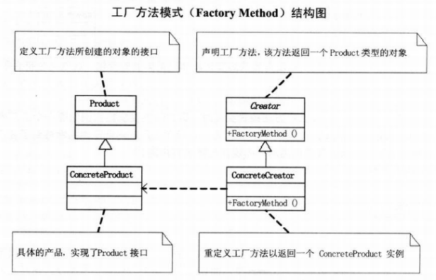

# 1 简单工厂模式
## 1.1 简介
一个工厂类根据传入的参量决定创建出那一种产品类的实例。  
* 通过封装、继承、多态把程序的耦合度降低，使得程序更加灵活，易于修改且易于重复。
* 工厂类中包含了必要的逻辑判断，可以根据不同条件动态实例化相关的类，但如果要增加新的需求就需要改动这个工厂类，违背了开放-封闭原则。
## 1.2 流程
* 设计一个抽象产品类，包含一些公共方法的实现；
* 从抽象类中派生出多个具体产品类；
* 设计一个工厂类，工厂类中提供一个生产各种产品的工厂方法，该方法根据传入参数创建不同的具体产品类对象；  
## 1.3 UML

# 2 工厂模式
## 2.1 简介
定义一个用于创建对象的接口，让子类决定实例化哪一个类，工厂方法使得一个类的实例化延迟到其子类。
* 工厂方法模式在增加功能时，不需要改动原有的工厂类，但缺点是每增加新功能就需要增加新的类，增加了开发量。
## 2.2 场景
有几个不同的类，且这几个类有共同的父类；  
在不同的条件下用这几个类创造不同的对象；  
在新增功能时，不想改动原有的类。  
## 2.3 UML

