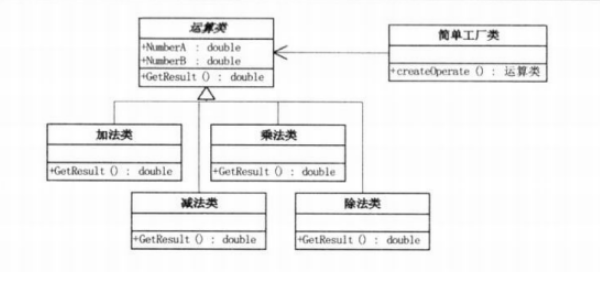

# 1 简单工厂模式
## 1.1 简介
通过封装、继承、多态把程序的耦合度降低，使得程序更加灵活，易于修改且易于重复。  
考虑一个用单独的类来创造实例的过程，这就是工厂。  
简单工厂：一个工厂类根据传入的参量决定创建出那一种产品类的实例。  
## 1.2 流程
* 设计一个抽象产品类，包含一些公共方法的实现；
* 从抽象类中派生出多个具体产品类；
* 设计一个工厂类，工厂类中提供一个生产各种产品的工厂方法，该方法根据传入参数创建不同的具体产品类对象；  
## 1.3 UML

